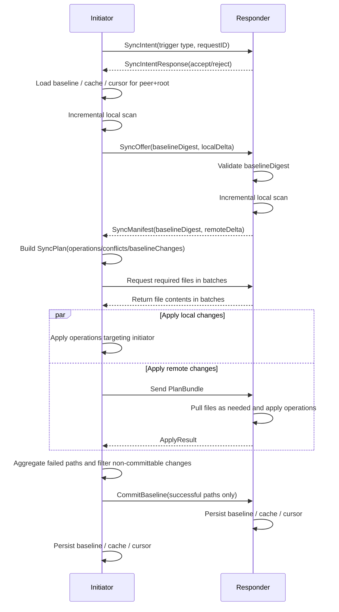

# SyncTwin Product Design Document (Current Version)

- Scope: product requirements and flow design based on the current repository implementation
- App version: `1.0.10`
- Protocol version: `2`
- Updated on: `2026-06-10`
- Chinese version: [SyncTwin_Product_Design.md](./SyncTwin_Product_Design.md)
- Documentation maintenance policy: this design document and the README should be maintained together in both Chinese and English going forward.

## 1. Document Goal

This document organizes the product requirements, interaction flows, sync rules, data design, and boundary conditions already implemented in the current SyncTwin version into a maintainable product design document. It describes the current implementation, not an aspirational future-state plan.

## 2. Product Positioning

SyncTwin is a macOS two-device directory sync tool designed for two MacBooks that both have the app installed. It performs bidirectional sync for a selected directory over a local network environment.

Its core goal is not "overwrite as quickly as possible," but "complete bidirectional sync without losing any new content from either side":

1. The sync channel should avoid the public internet as much as possible.
2. New modifications on either side must never be silently overwritten.
3. Conflicts must be surfaced explicitly and allow manual judgment.
4. The product must support both auto-sync and manual sync.
5. Sync must be rejected when the two app versions differ.
6. In large-directory scenarios, full rescans and unnecessary comparisons should be minimized.

## 3. Usage Scenarios

The current version mainly covers these scenarios:

1. One person owns two Macs and wants to sync a working directory at home, in the office, or over a hotspot in a nearby network environment.
2. Both directories may contain additions, modifications, and deletions, and the final result must converge bidirectionally.
3. The directory can be large enough that recalculating content hashes for every file on every sync is unacceptable.
4. Users want to see sync progress, estimated time remaining, and actionable conflict handling.

## 4. Current Version Requirement List

### 4.1 Connectivity and Security

1. The app must be installed and running on both devices.
2. Sync communication must not rely on a public internet relay. The current implementation uses `MultipeerConnectivity` for nearby peer-to-peer transport.
3. The transport channel must be encrypted.
4. The app should discover and connect peers over LAN, peer-to-peer Wi-Fi, Bluetooth, or other nearby transports supported by the system.

Note:
The current sync data plane is local and nearby. App update checking and installer download access GitHub, but that belongs to the update feature rather than the sync data plane.

### 4.2 Sync Safety Rules

1. Sync must avoid silently overwriting new modifications on either computer.
2. Any sync triggered from either side must be bidirectional, not a one-way push.
3. When both sides changed the same path and the results differ, the path must enter conflict state.
4. Conflict resolution must preserve the unselected version as a conflict backup so that manual decisions still do not lose content.
5. Only paths applied successfully may be written into the new sync baseline; failed paths must not pretend to be "already synced."

### 4.3 Trigger Modes

1. Support manual "Sync Now" triggering.
2. Support fixed-interval auto-sync with a configurable interval.
3. When auto-sync is enabled, the timer should attempt sync automatically when the interval elapses.
4. If a sync session is already running, a new scheduled sync must not start.
5. If the local app is currently running an automatic sync and the user clicks "Sync Now," the current session should be promoted to manual semantics, including UI state and completion sound behavior.
6. When the sync directory is changed or reselected, the app must clear that directory's historical baseline, cache, and cursor so that stale sync history from an old directory or old session cannot affect the current directory.

### 4.4 Version and Compatibility

1. The two sides must exchange a `Hello` handshake after connecting.
2. If the app versions differ, sync must be blocked.
3. If the protocol versions differ, sync must be blocked.
4. The UI should clearly surface version mismatches and update entry points.

### 4.5 Performance and Experience

1. Large-directory sync should prefer incremental scanning to reduce full MD5 recalculation.
2. Both computers should show a progress bar during sync.
3. Progress text should display real processing progress as much as possible, such as received or processed file counts.
4. The UI should show an estimated remaining time close to the whole sync session, not only the current step.
5. Manual sync should play a completion sound; automatic sync sound should be configurable.
6. The sync pipeline must completely ignore `.DS_Store`, with no comparison, sync, delete decision, or conflict handling for it.

### 4.6 Update Capability

1. The app should check GitHub Releases on launch.
2. If a newer version exists and a recognizable macOS installer is available, it should be downloaded automatically.
3. Users can manually check for updates by clicking "Check for Updates."
4. Users can open the Release page and reveal the downloaded installer in Finder.

## 5. Non-Goals and Current Boundaries

The current version does not cover the following:

1. No cloud relay or public internet traversal.
2. No background agent or daemon; both apps need to remain running.
3. No simultaneous sync with multiple peers; the current design assumes one peer and one active session.
4. Large files now use chunked transfer, but both apps still need to remain running during the transfer.
5. Symbolic links are not treated as sync objects; symlinks are skipped by the current implementation.
6. No custom account system, permission system, or organization-level multi-device management.

## 6. Product Principles

### 6.1 Safety Over Automation

When "auto-merge" conflicts with "avoid content loss," the product chooses content safety. The system would rather escalate a path into a conflict than guess and overwrite on the user's behalf.

### 6.2 Bidirectional Reconciliation, Not a Single Source of Truth

Neither device is the absolute master. In a session, initiator and responder are sync roles, not indicators of data authority.

### 6.3 Ask for Manual Judgment Only When Truly Necessary

By combining a shared baseline, deltas from both sides, and automatic elimination of identical outcomes, manual decisions are reduced to true divergence cases only.

### 6.4 Commit the Baseline Only on Success

Only paths that both sides processed successfully should update the baseline. This prevents later sync runs from mistakenly treating failed paths as already aligned.

## 7. Key Concepts

### 7.1 Local Sync Root Directory

Each Mac independently chooses its own sync root directory. Sync logic compares relative paths under the root, so the absolute paths on the two machines may differ.

### 7.2 Sync Baseline

The baseline represents "what state each relative path was in after the last sync both sides confirmed as complete." Subsequent sync runs no longer ask "which whole tree is newer," but instead compare "what changed on each side relative to the shared baseline."

### 7.3 File Fingerprint

The current version uses the following information to describe path state:

1. `contentHash`: MD5 for files; a fixed marker `__directory__` for directories
2. `size`
3. `modifiedAt`
4. `isDirectory`

### 7.4 Delta Manifest

Each scan produces two parts:

1. `changedFiles`: file or directory states that differ from the baseline
2. `deletedPaths`: paths that existed in the baseline but no longer exist now

### 7.5 Conflict

The current version defines three conflict types:

1. `bothModified`: both sides modified the same path
2. `modifyVsDelete`: one side modified the path while the other deleted it
3. `bothCreatedDifferently`: both sides created the same path but with different content

## 8. Overall Architecture

The current implementation can be abstracted into six subsystems:

1. `ContentView`
   - Settings, connection, sync, conflict handling, update entry points, activity log, and progress display
2. `SyncTwinController`
   - Session control, sync state machine, conflict resolution, ETA estimation, and update coordination
3. `PeerTransport`
   - Peer discovery, connection management, and encrypted message transport
4. `DirectoryScanner` + `DirectoryChangeMonitor`
   - File system scanning, MD5 fingerprinting, FSEvents change tracking, and incremental scanning
5. `SyncPlanner`
   - Sync plan generation, conflict detection, and baseline change generation based on the shared baseline
6. `AppStorage`
   - Configuration, local cache, baseline, directory change journal, peer cursor, conflict previews, and update persistence

## 9. Core Flow Design

### 9.1 App Launch Flow

1. Load local configuration.
2. Start nearby discovery and advertising.
3. If a sync directory has already been selected, start FSEvents monitoring for that directory.
4. Start the auto-sync timer loop based on settings.
5. Automatically check the latest GitHub Release.

### 9.2 Connection and Version Validation Flow

1. The user connects to a peer from the device list.
2. After connection succeeds, both sides exchange `HelloMessage`.
3. Validate:
   - whether `appVersion` matches
   - whether `protocolVersion` matches
4. If either check fails, the status area displays a warning and sync is blocked.

### 9.3 Sync Trigger Flow

#### Manual Sync

1. The user clicks "Sync Now."
2. If no sync session is active, the local app creates a new session and starts the handshake.
3. If the local app is currently in auto-sync, that session is promoted to manual sync.

#### Automatic Sync

1. When the timer fires, the app checks:
   - whether auto-sync is enabled
   - whether a sync is already in progress
   - whether a peer is connected
   - whether versions are compatible
   - whether a sync directory is selected
2. To avoid both sides initiating auto-sync at the same time, only the side with the smaller `deviceID` actively initiates automatic sync.

### 9.4 Sync Session Mutual Exclusion and Arbitration

To avoid both Macs initiating sync simultaneously and creating process conflicts, the current version performs a `SyncIntent` handshake before the real sync starts.

Rules:

1. If the peer is idle, accept the sync.
2. If both sides are in the "waiting for permission" stage:
   - manual sync has higher priority than automatic sync
   - if priorities are equal, the side with the smaller `deviceID` wins
3. If one side is already executing a sync, reject new concurrent sync requests.

This guarantees:

1. Scheduled sync does not start while a manual sync is running.
2. Any sync triggered from either side must complete a two-sided handshake and arbitration first.
3. The two sides do not run two overlapping sync flows that can overwrite each other.

### 9.5 Main Bidirectional Sync Flow

### 9.6 Scan and Reconciliation Rules

The current implementation does not fully compare every file on every sync. Instead, it prefers the following path:

1. Load the local fingerprint cache for the current "peer device + local root directory."
2. Load the FSEvents change journal for the root directory.
3. Load the last sync cursor for the current "peer device + local root directory."
4. If the journal is continuous, the cache exists, and the cursor is valid, rescan only paths or subtrees marked dirty since the last sync.
5. Recalculate MD5 only for dirty paths; reuse cached fingerprints for unchanged files.
6. Fall back to a full scan if the journal is invalid, the root changed, events were dropped, or the cache is incomplete.

This avoids rechecking every file on every sync when both sides contain many unchanged files.

### 9.7 Sync Plan Generation Rules

The sync plan is centered on the shared baseline and looks at how both initiator and responder differ from that baseline:

1. Only one side changed: generate a sync operation to update the other side automatically.
2. Both sides changed but the results are identical: no manual judgment is needed; write the resulting state into the new baseline directly.
3. Both sides changed and the results differ: generate a conflict item and do not overwrite automatically.

The plan produces three kinds of outputs:

1. `operations`
   - write or delete actions that must be executed on one side
2. `conflicts`
   - paths that require manual judgment
3. `baselineChanges`
   - resulting path states that can be committed if the session succeeds

### 9.8 File Transfer Rules

1. The two sides transfer only file contents that are actually needed by the current plan.
2. File pulls are done in batches to reduce blocking from very large messages.
3. Each batch is limited by both file count and total bytes.
4. Timeouts are not fixed constants; they are estimated dynamically based on file count, batch count, byte size, and operation count.
5. Before sending, the sender revalidates that the current file state still matches the request's `expectedState`; if the file already changed again, that path fails directly and old content is not sent.

### 9.9 Local Apply Rules

When applying changes, every path is checked against the plan's expected current state first:

1. If it does not match, it means the user changed the file again during sync, so the path fails and is not overwritten.
2. Delete operations are executed with deeper paths first, so parent directories are not removed too early.
3. Create operations are executed with directories first and shallower paths first, so parent directories exist before files are written.
4. Directories are first-class sync objects; directory creation and deletion both enter the plan and the baseline.

### 9.10 Baseline Commit Rules

1. The initiator aggregates local failures, remote failures, and file transfer failures.
2. All failed paths are removed from `baselineChanges`.
3. Only successful paths are committed into the baseline on both sides.
4. Conflict paths are not auto-committed; they must wait for manual resolution before the baseline is updated.

### 9.11 Conflict Handling Flow

After the system detects a conflict:

1. The conflict list shows the path, conflict reason, and local/remote summaries.
2. The user can open the local version or preview the remote snapshot.
3. The user chooses "Use Local Version" or "Use Remote Version."
4. Before actually applying the choice, the system validates again:
   - whether the local path is still in the same conflict state
   - whether the remote path is still in the same conflict state
5. If either side changed again, the current decision is rejected and a resync is required.
6. When the decision is applied, the unselected version is preserved as a conflict backup near the original path.
7. After the decision succeeds, the new sync baseline is written back.

### 9.12 Update Flow

1. The app checks the latest GitHub Release on startup.
2. Version comparison ignores the `v` prefix and compares numeric components.
3. If a newer version is found, the app prefers supported macOS installer assets:
   - `zip`
   - `dmg`
   - `pkg`
4. If the asset was already downloaded locally, it is reused directly.
5. If it is not yet downloaded, it is automatically downloaded into `~/Downloads/SyncTwin Updates/...`.
6. Users can also click "Check for Updates" to trigger a manual check.

## 10. Interaction Design

### 10.1 Main Screen Structure

The current main UI contains these areas:

1. Header status area
   - app name
   - positioning statement
   - local app version
   - current status badge
   - version gate warning
2. Sync settings area
   - device name
   - auto-sync interval
   - sync directory picker
   - auto-sync toggle
   - auto-sync completion sound toggle
   - update actions
   - save settings
   - sync now
3. Peer connection area
   - currently connected peer information
   - discovered peer list
4. Conflict handling area
   - conflict list
   - open local version / open remote snapshot
   - use local / use remote
5. Recent activity area
   - recent logs
6. Progress area
   - phase name
   - percentage
   - progress bar
   - current step detail
   - estimated remaining time

### 10.2 Progress and Estimated Remaining Time

The current ETA does not focus on a single step. It estimates progress across the whole sync session. The system tracks cumulative progress in the following work buckets:

1. session handshake
2. local scan
3. remote scan
4. planning
5. receiving files
6. sending files
7. applying local changes
8. applying remote changes
9. final commit

The estimated remaining time shown in the UI is based on the overall completion ratio of these work buckets, so it is much closer to "how much longer this whole sync session will take."

Note:
ETA is still an estimate. It can drift in very small samples, when files change suddenly, or when the network slows down sharply. Its goal is to reflect whole-session completion time, not the duration of a single step.

### 10.3 Sound Feedback

1. Manual sync always plays a completion sound.
2. Automatic sync plays a completion sound only when the "Play sound when auto-sync completes" option is enabled.
3. If an automatic sync is manually taken over by the user, it is treated as manual sync.

## 11. Data Storage Design

The app uses local persistent storage for configuration and sync state. Core data includes:

1. `config.json`
   - local configuration
2. `Baselines/`
   - sync baselines isolated by "peer device ID + local root directory"
3. `LocalFingerprints/`
   - local fingerprint caches isolated by "peer device ID + local root directory"
4. `DirectoryJournals/`
   - directory change journals isolated by "local root directory"
5. `PeerSyncCursors/`
   - sync cursors isolated by "peer device ID + local root directory"
6. `ConflictPreviews/`
   - remote file snapshots and conflict preview cache
7. `~/Downloads/SyncTwin Updates/`
   - automatically downloaded update installers

### 11.1 Isolation Strategy

To avoid reusing one cache set incorrectly with another peer:

1. baselines are isolated by `peerDeviceID + rootPathDigest`
2. local fingerprint caches are isolated by `peerDeviceID + rootPathDigest`
3. sync cursors are isolated by `peerDeviceID + rootPathDigest`

This means:

1. the same Mac gets independent cache sets when syncing with different peers
2. the same Mac also gets independent cache space when switching sync root directories

## 12. Performance Design

### 12.1 Why the App Does Not Recalculate Full MD5 Every Time

The current optimization strategy is change-driven scanning:

1. directory monitoring records which paths changed since the last sync
2. the next sync rescans only those dirty paths
3. unchanged files keep using cached fingerprints
4. only files that truly need recalculation are reread and hashed again

### 12.2 Why the Baseline Is Still Necessary

Even with a local cache, the baseline is still required because:

1. the cache answers "what does the local side look like now?"
2. the baseline answers "what did both sides last confirm together?"

Only by separating those two concepts can the system correctly distinguish:

1. one-sided additions, modifications, and deletions
2. independent changes on both sides
3. both sides changed but ended up with the same result
4. which paths must not be mistaken as complete after a partial failure

### 12.3 Optimization Points for Large Sync Sessions

1. files are transferred in batches
2. operations are applied in batches
3. timeouts are widened dynamically based on workload
4. both sides display processing progress
5. ETA is estimated from whole-session work buckets

## 13. Error Handling Strategy

The current version mainly handles these error scenarios in the following ways:

1. No directory selected
   - reject sync and ask the user to choose a directory first
2. No peer connected
   - reject sync and ask the user to connect the other device first
3. Version or protocol mismatch
   - reject sync and display update guidance
4. Baseline digest mismatch
   - reject the session and report that the two sides' baselines differ
5. A file changes again during sync
   - mark that path as failed, do not overwrite it, and do not write it into the baseline
6. A file changes before it is sent
   - return failure for that path and do not send stale content
7. Either side changes again during conflict resolution
   - invalidate the current conflict decision and require a resync
8. Timeout during a large sync
   - report a stage-based timeout and ask the user to check whether both sides are online
9. Peer disconnect
   - interrupt the session, clear pending waiters, and preserve the unfinished state

## 14. Key Product Judgments Already Satisfied in the Current Version

Based on the current implementation, the following statements are true:

1. Scheduled sync does not start while a manual sync is running.
2. Any sync triggered from either Mac must first complete two-sided handshake and mutual-exclusion arbitration.
3. Any sync initiated from either Mac performs bidirectional reconciliation and bidirectional apply, not one-way pushing.
4. Conflicts are never swallowed silently; they require manual judgment.
5. Non-conflict paths are handled automatically as much as possible to reduce manual work.
6. New directories, new files, and deletions under existing directories are all part of the sync scope.

## 15. Current Limitations and Risk Notes

1. The sync channel is a local encrypted nearby transport, but there is currently no additional human-confirmed device identity verification flow.
2. Only one active peer connection is supported; this is not a multi-device mesh sync product.
3. Large files are now supported through chunked transfer, but weak connectivity or device sleep may still require a retry.
4. Only regular files and directories are synced; symbolic links are not currently supported.
5. Conflict preview is mainly aimed at file content; directory conflicts do not have a rich diff preview yet.
6. Both devices' apps must remain running; there is currently no login-time background resident service.
7. Update capability depends on GitHub network reachability. This does not affect the local sync protocol itself, but it does affect the auto-update experience.

## 16. Suggested Next Evolutions

If the product keeps moving toward a more polished release, the following priorities are recommended:

1. Add explicit device pairing confirmation to improve nearby identity trust
2. Add a background resident agent to reduce the requirement that both apps stay in the foreground
3. Add a more intuitive conflict diff view
4. Expand from single-peer sync to a multi-device sync topology
6. Add clearer historical session records and a retry center for failures

## 17. Summary

The current SyncTwin version already forms a complete local, nearby, two-Mac, bidirectional, safety-first sync loop:

1. validate versions before creating a session
2. compare changes against a shared baseline before deciding what can auto-sync
3. automatically handle one-sided changes and same-result changes
4. collapse true divergence into a small number of conflicts for human judgment
5. write only successful paths into the new baseline while advancing cache, cursor, and directory journal state together

From a product point of view, the current version already meets the core goals of safety first, bidirectional sync, minimal manual judgment, and incremental sync for large directories.
