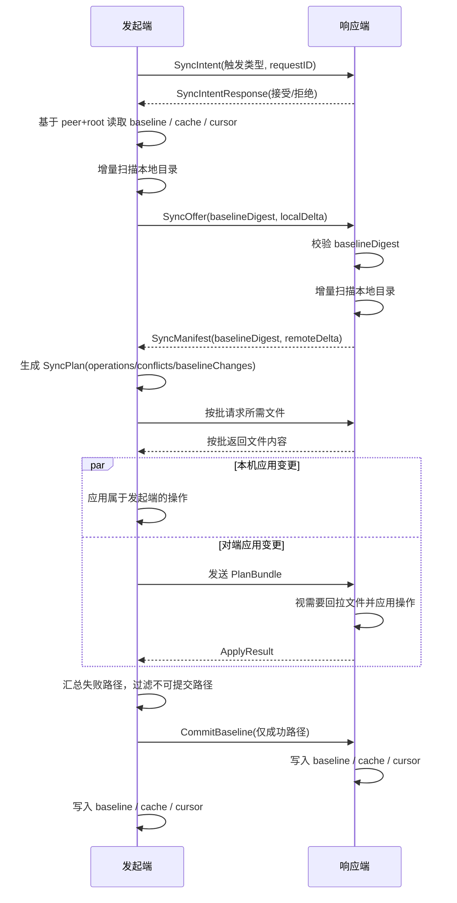

# SyncTwin 当前版本产品设计文档

- 文档范围：基于当前仓库实现梳理产品需求与流程设计
- 对应应用版本：`1.0.10`
- 对应协议版本：`2`
- 更新时间：`2026-06-10`
- English version: [SyncTwin_Product_Design.en.md](./SyncTwin_Product_Design.en.md)
- 文档维护约定：本设计文档与 README 后续保持中英文同步更新。

## 1. 文档目标

本文档用于把 SyncTwin 当前版本已经落地的产品需求、交互流程、同步规则、数据设计和边界条件整理成一份可持续维护的产品设计文档。本文档描述的是“当前实现”，不是未来愿景稿。

## 2. 产品定位

SyncTwin 是一个运行在 macOS 上的双机目录同步工具，面向两台都安装了应用的 MacBook，在本地网络环境中完成指定目录的双向同步。

它的核心目标不是“尽快覆盖”，而是“在不丢失任何一边新内容的前提下完成双向同步”：

1. 同步链路尽量不走互联网公网。
2. 任意一边的新修改不能被静默覆盖。
3. 冲突必须显式提示，并允许人工判断。
4. 能自动同步，也能手工触发。
5. 两端版本不一致时拒绝同步。
6. 在大目录场景下尽量减少全量扫描和无效比对。

## 3. 使用场景

当前版本主要覆盖以下场景：

1. 同一人拥有两台 Mac，在办公室/家里/移动热点等近距离网络环境中同步工作目录。
2. 两端目录中都可能发生新增、修改、删除，要求最终达成双向一致。
3. 目录规模较大，不能每次同步都重新计算所有文件的内容摘要。
4. 用户希望看到同步进度、预计剩余时间，以及冲突后的可操作入口。

## 4. 当前版本需求清单

### 4.1 连接与安全

1. 两台设备都必须安装并运行 SyncTwin。
2. 同步通信不依赖公网中转，当前使用 `MultipeerConnectivity` 建立附近设备直连能力。
3. 传输链路启用加密传输。
4. 可在局域网、点对点 Wi‑Fi、蓝牙等系统支持的近场连接环境中发现和连接对端。

说明：
当前“同步数据面”是本地近场连接；“应用更新检查/下载安装”会访问 GitHub，这部分属于更新能力，不属于同步数据面。

### 4.2 同步安全规则

1. 同步必须避免任意一台电脑上的新修改被静默覆盖。
2. 任一侧触发的同步都必须是双向同步，不是单向推送。
3. 当双方都改过同一路径且结果不同，必须进入冲突状态。
4. 冲突处理必须保留未被选中的版本为冲突副本，避免人工判断后仍然丢内容。
5. 只有成功应用的路径才允许写入新的同步基线；失败路径不得伪装成“已同步”。

### 4.3 触发方式

1. 支持“立即同步”手工触发。
2. 支持按固定间隔自动同步，间隔可配置。
3. 自动同步开启时，定时器到点后自动尝试发起同步。
4. 如果当前已有同步会话在执行，新的自动同步不得插队启动。
5. 如果本机正在自动同步，用户点击“立即同步”，当前会话应提升为“手动同步”语义，界面状态与完成提示音也按手动同步处理。
6. 切换或重新选择同步目录时，程序需要清除该目录对应的历史同步基线、缓存和游标，避免旧目录或旧会话的历史状态误伤当前目录。

### 4.4 版本与兼容性

1. 两端连接后必须先交换 `Hello` 握手信息。
2. 若应用版本不一致，禁止开始同步。
3. 若协议版本不一致，禁止开始同步。
4. 需要在界面中明确提示版本不匹配与更新入口。

### 4.5 性能与体验

1. 大目录同步时优先使用增量扫描，减少全量 MD5 计算。
2. 同步过程两台电脑都显示进度条。
3. 进度文案应尽量展示实际处理进度，如已接收/已处理文件数。
4. 需要显示“接近整个同步过程”的预计剩余时间，而不只是当前步骤剩余时间。
5. 手动同步完成后播放提示音；自动同步是否播放由设置项控制。
6. 同步过程需要完全忽略 `.DS_Store`，不对它做检查、同步、删除决策或冲突处理。

### 4.6 更新能力

1. 应用启动后自动检查 GitHub Release。
2. 若发现更高版本且有可识别的 macOS 安装包，则自动下载到本地。
3. 用户可点击“查看更新”手工检查。
4. 用户可打开 Release 页面，也可在访达中显示已下载安装包。

## 5. 非目标与当前边界

当前版本暂不覆盖以下能力：

1. 不提供云端中转或公网穿透。
2. 不提供后台守护进程；两端应用都需要保持运行。
3. 不支持多个对端同时同步；当前设计按单对端、单活动会话处理。
4. 大文件已改为分块传输，但传输期间仍要求两端应用保持运行。
5. 不以符号链接为同步对象；当前实现会跳过 symlink。
6. 不提供自定义账号体系、权限体系或组织级多设备管理。

## 6. 产品原则

### 6.1 安全优先于自动化

当“自动合并”与“避免丢内容”冲突时，优先保护内容安全。系统宁可把路径提升为冲突，也不能替用户猜测并覆盖。

### 6.2 双向对账，不做单边真相源

任何一台设备都不是绝对主库。当前会话中，发起端和响应端只是同步角色，不代表数据权威性。

### 6.3 只在必要处要求人工判断

通过“同步基线 + 双端增量 + 状态相等自动消解”的方式，把人工判断压缩到真正的分叉冲突上。

### 6.4 成功才提交基线

只有双方都成功处理的路径，才更新基线。这样后续同步不会误以为失败文件已经对齐。

## 7. 关键概念

### 7.1 本地同步根目录

每台 Mac 独立选择自己的同步根目录。同步逻辑基于根目录下的相对路径进行比较，因此两台机器上的绝对路径可以不同。

### 7.2 同步基线（Baseline）

基线表示“上一次双方确认同步完成后，各相对路径应当处于什么状态”。之后的同步不再比较“整棵树谁更新”，而是比较“各自相对于共同基线发生了什么变化”。

### 7.3 文件指纹（Fingerprint）

当前版本使用以下信息描述路径状态：

1. `contentHash`：文件为 MD5；目录为固定标记 `__directory__`
2. `size`
3. `modifiedAt`
4. `isDirectory`

### 7.4 增量变更清单（Delta Manifest）

每次扫描会生成两部分：

1. `changedFiles`：相对基线发生变化的文件或目录状态
2. `deletedPaths`：基线里存在但当前已不存在的路径

### 7.5 冲突

当前版本定义三类冲突：

1. `bothModified`：双方都改了同一路径
2. `modifyVsDelete`：一边改了，另一边删了
3. `bothCreatedDifferently`：双方都新建了同一路径，但内容不同

## 8. 整体架构

当前实现可以抽象为 6 个子系统：

1. `ContentView`
   - 配置、连接、同步、冲突处理、更新入口、日志、进度展示
2. `SyncTwinController`
   - 会话控制、同步状态机、冲突决议、进度估算、更新协调
3. `PeerTransport`
   - 设备发现、连接管理、加密消息收发
4. `DirectoryScanner` + `DirectoryChangeMonitor`
   - 文件系统扫描、MD5 指纹计算、FSEvents 变更跟踪、增量扫描
5. `SyncPlanner`
   - 基于共同基线生成同步计划、冲突列表、基线变更列表
6. `AppStorage`
   - 配置、本地缓存、基线、目录变更日志、对端游标、冲突预览、更新文件持久化

## 9. 核心流程设计

### 9.1 应用启动流程

1. 读取本地配置。
2. 启动局域网发现与广播。
3. 如果已选择同步目录，则启动该目录的 FSEvents 监听。
4. 根据设置启动自动同步定时循环。
5. 自动检查 GitHub 最新 Release。

### 9.2 建连与版本校验流程

1. 用户在设备列表中连接对端。
2. 连接成功后，双方交换 `HelloMessage`。
3. 校验：
   - `appVersion` 是否一致
   - `protocolVersion` 是否一致
4. 任一项不一致则状态栏提示并禁止同步。

### 9.3 同步触发流程

#### 手工同步

1. 用户点击“立即同步”。
2. 若当前没有同步会话，则本机创建新会话并发起握手。
3. 若当前本机正处于自动同步，则将当前会话提升为手动同步。

#### 自动同步

1. 定时循环到点后检查：
   - 自动同步是否开启
   - 当前是否已有同步在执行
   - 是否已连接对端
   - 版本是否兼容
   - 是否已选择同步目录
2. 为避免两端同时定时触发，当前仅由 `deviceID` 较小的一侧负责主动发起自动同步。

### 9.4 同步会话互斥与仲裁

为避免两台电脑同时发起同步导致冲突，当前版本在真正开始同步前会先进行 `SyncIntent` 握手。

规则如下：

1. 若对端空闲，则接受本次同步。
2. 若两端都在“等待授权”阶段：
   - 手动同步优先级高于自动同步
   - 若优先级相同，则 `deviceID` 较小者获胜
3. 若一端已经进入执行中，则拒绝新的并发同步请求。

这套规则保证：

1. 手工同步执行期间，定时同步不会启动。
2. 任意一端触发同步，都需要先完成双端握手仲裁。
3. 两端不会各自独立跑出两条互相覆盖的同步流程。

### 9.5 双向同步主流程

### 9.6 扫描与对账规则

当前不是每次都全量重新比对所有文件内容，而是优先走以下路径：

1. 从持久化读取该“对端设备 + 本地根目录”对应的本地指纹缓存。
2. 读取该根目录的 FSEvents 变更日志。
3. 读取该“对端设备 + 本地根目录”对应的上次同步游标。
4. 若日志连续、缓存存在、游标有效，则只重扫自上次同步后被标记为 dirty 的路径或子树。
5. 只有 dirty 路径才重新计算 MD5；未变化的文件直接复用缓存指纹。
6. 若日志失效、根目录变化、事件丢失或缓存不完整，则回退到全量扫描。

这样可以避免在两端目录都很大、且大多数文件未变更的情况下，每次同步都对所有文件重新做内容比对。

### 9.7 同步计划生成规则

同步计划以“共同基线”为中心，分别看发起端和响应端相对于基线的变化：

1. 只有一边变了：自动生成对另一边的同步操作。
2. 两边都变了但结果完全一致：不需要人工判断，直接把该状态写入新基线。
3. 两边都变了且结果不同：生成冲突项，不自动覆盖。

计划输出分为三类：

1. `operations`
   - 需要在某一侧执行的写入/删除动作
2. `conflicts`
   - 需要人工判断的路径
3. `baselineChanges`
   - 本次成功后可提交的新基线状态

### 9.8 文件传输规则

1. 同步双方只传输当前计划真正需要的文件内容。
2. 文件拉取按批进行，减少大批量消息阻塞。
3. 单批次同时受文件数和总字节数限制。
4. 超时时间不是固定死值，而是按文件数、批次数、字节数、操作数动态估算。
5. 文件发送前会再次校验当前文件状态是否仍与请求中的 `expectedState` 一致；若发送前已经变化，则该路径直接失败，不继续传输旧内容。

### 9.9 本地应用规则

应用变更时，每个路径都会先检查“当前实际状态是否等于计划中的预期状态”：

1. 若不一致，说明同步过程中用户又改了文件，该路径判失败，不覆盖。
2. 删除操作按“更深层路径优先删除”执行，避免先删父目录导致子项处理异常。
3. 创建操作按“目录优先、浅层优先”执行，确保父目录先创建，再写文件。
4. 目录是一级同步对象，目录新增、删除都会进入计划与基线。

### 9.10 基线提交规则

1. 发起端汇总本地失败、对端失败、文件传输失败。
2. 所有失败路径从 `baselineChanges` 中剔除。
3. 只有成功路径才提交到双方基线。
4. 冲突路径不会进入自动提交，需要等待人工决议后再更新基线。

### 9.11 冲突处理流程

当系统识别到冲突后：

1. 冲突列表展示路径、冲突原因、本机/对方摘要。
2. 用户可打开本机版本，或打开对方快照预览。
3. 用户选择“采用本机版本”或“采用对方版本”。
4. 系统会在真正执行前再次校验：
   - 本机该路径是否还是当时的冲突状态
   - 对端该路径是否还是当时的冲突状态
5. 若任何一边又变了，则拒绝当前决议，要求重新同步。
6. 决议执行时，未选中的版本会以冲突副本方式保留在本地目录附近。
7. 决议完成后再写回新的同步基线。

### 9.12 更新流程

1. 应用启动即检查 GitHub 最新 Release。
2. 版本比较会忽略 `v` 前缀并按数字组件比较。
3. 若发现新版本，会优先选择支持的 macOS 安装资产：
   - `zip`
   - `dmg`
   - `pkg`
4. 若本地已下载过对应资产，则直接复用。
5. 若未下载，则自动下载到 `~/Downloads/SyncTwin Updates/...`。
6. 用户也可手动点击“查看更新”立即检查。

## 10. 交互设计

### 10.1 主界面结构

当前主界面包含以下区域：

1. 头部状态区
   - 应用名
   - 产品定位说明
   - 本机版本
   - 当前状态 Badge
   - 版本门禁提示
2. 同步设置区
   - 设备名称
   - 自动同步间隔
   - 同步目录选择
   - 自动同步开关
   - 自动同步完成提示音开关
   - 更新相关操作
   - 保存设置
   - 立即同步
3. 对端连接区
   - 已连接对端信息
   - 发现到的可连接设备列表
4. 冲突处理区
   - 冲突列表
   - 打开本机版 / 打开对方快照
   - 采用本机 / 采用对方
5. 最近活动区
   - 最近日志
6. 进度区
   - 阶段名
   - 百分比
   - 进度条
   - 当前步骤详情
   - 预计剩余时间

### 10.2 进度与预计剩余时间

当前 ETA 不是简单盯住单个步骤，而是按整轮同步过程估算。系统会分别给以下工作桶累计进度：

1. 会话握手
2. 本地扫描
3. 对端扫描
4. 计划生成
5. 接收文件
6. 发送文件
7. 应用本地变更
8. 应用对端变更
9. 最终提交

界面上的预计剩余时间基于这些工作桶的整体完成度计算，因此更接近“本轮同步还要多久结束”。

说明：
ETA 仍然是估算值，在极端小样本、突发文件变化或网络突然变慢时会偏差，但它的目标是反映整体会话完成时间，而不是单步耗时。

### 10.3 声音反馈

1. 手动同步完成后一定播放提示音。
2. 自动同步完成后，只有当“自动同步完成时播放提示音”开启才播放。
3. 如果自动同步进行中被用户手工接管，则按手动同步处理。

## 11. 数据存储设计

应用使用本地持久化目录保存配置和同步状态，核心数据包括：

1. `config.json`
   - 本机配置
2. `Baselines/`
   - 按“对端设备 ID + 本地根目录”隔离的同步基线
3. `LocalFingerprints/`
   - 按“对端设备 ID + 本地根目录”隔离的本地指纹缓存
4. `DirectoryJournals/`
   - 按“本地根目录”隔离的目录变更日志
5. `PeerSyncCursors/`
   - 按“对端设备 ID + 本地根目录”隔离的同步游标
6. `ConflictPreviews/`
   - 对端文件快照与冲突预览缓存
7. `~/Downloads/SyncTwin Updates/`
   - 自动下载的更新安装包

### 11.1 隔离策略

为了避免“一套缓存错误复用到另一个对端”：

1. 基线按 `peerDeviceID + rootPathDigest` 隔离
2. 本地指纹缓存按 `peerDeviceID + rootPathDigest` 隔离
3. 同步游标按 `peerDeviceID + rootPathDigest` 隔离

这意味着：

1. 同一台 Mac 和不同对端同步时，各自有独立缓存
2. 同一台 Mac 切换同步根目录时，也会得到独立缓存空间

## 12. 性能设计

### 12.1 为什么不会每次都全量 MD5

当前优化思路是“变更驱动扫描”：

1. 目录监听先记录哪些路径自上次同步后变了
2. 下次同步只对这些 dirty 路径重新扫描
3. 未变化文件直接沿用上次缓存指纹
4. 只有确实需要重算的文件才重新读文件并计算 MD5

### 12.2 为什么仍然保留基线

即便有本地缓存，也仍需基线，因为：

1. 缓存回答的是“本机现在是什么”
2. 基线回答的是“双方上次共同确认是什么”

只有把这两个概念分开，才能正确区分：

1. 单边新增/修改/删除
2. 双边独立改动
3. 双边改了但结果相同
4. 同步失败后哪些路径不能误记为已完成

### 12.3 大批量同步时的优化点

1. 文件按批传输
2. 操作按批执行
3. 超时按工作量动态放宽
4. 双方都展示处理进度
5. ETA 按整轮工作桶估算

## 13. 错误处理策略

当前版本主要错误场景与处理方式如下：

1. 未选择目录
   - 拒绝同步并提示用户先选择目录
2. 未连接对端
   - 拒绝同步并提示先连接另一台设备
3. 版本/协议不一致
   - 拒绝同步并显示更新提示
4. 基线摘要不一致
   - 拒绝本轮同步，提示两端基线不一致
5. 文件在同步过程中再次变化
   - 该路径标记失败，不覆盖，不写入基线
6. 文件发送前状态变化
   - 该路径返回失败，不发送旧内容
7. 冲突处理时任一侧状态又变化
   - 当前冲突决议失效，要求重新同步
8. 大批量同步超时
   - 以阶段化超时提示用户检查两端在线状态
9. 对端断连
   - 中断会话、清空等待队列、保留未完成状态

## 14. 当前版本已满足的关键产品判断

基于当前实现，以下判断成立：

1. 手工同步执行过程中，定时同步不会启动。
2. 任意一台电脑触发同步，都必须先完成双端握手与互斥仲裁。
3. 任意一台电脑发起的同步，都会完成双向对账和双向应用，不是单方向推送。
4. 冲突不会被静默吞掉，必须人工判断。
5. 非冲突路径会尽量自动处理，减少人工参与次数。
6. 已有目录下的新目录、新文件、删除操作都属于同步对象。

## 15. 当前限制与风险提示

1. 应用同步链路虽为本地近场加密传输，但当前没有额外的人机确认式设备认证流程。
2. 仅支持单对端活跃连接，不是多设备网状同步。
3. 大文件已通过分块传输支持，但在弱网络或设备休眠场景下仍可能需要重新发起同步。
4. 仅同步普通文件与目录，符号链接不在当前支持范围。
5. 冲突预览主要针对文件内容；目录冲突没有富文本式差异预览。
6. 必须两台设备上的应用都处于运行状态，当前没有登录后常驻后台服务。
7. 更新能力依赖 GitHub 网络可达性；这不影响本地同步协议本身，但会影响自动更新体验。

## 16. 后续演进建议

如果继续往产品化方向推进，建议按以下优先级演进：

1. 增加设备配对确认机制，提升近场连接的身份可信度
2. 增加后台常驻代理，减少“两边都要保持前台运行”的限制
3. 增加更直观的冲突 diff 视图
4. 从单对端扩展到多设备同步拓扑
6. 增加更明确的历史会话记录与失败重试中心

## 17. 总结

SyncTwin 当前版本已经形成一套完整的“本地近场双机双向安全同步”闭环：

1. 先校验版本，再建立会话
2. 先比较相对共同基线的变化，再决定是否自动同步
3. 自动处理单边变化和同结果变化
4. 把真正的分叉差异收敛为少量冲突，由人来裁决
5. 只把成功路径写入新基线，并把缓存、游标与目录日志一起推进

从产品角度看，当前版本已经满足“安全优先、双向同步、最小化人工判断、支持大目录增量同步”的核心目标。
